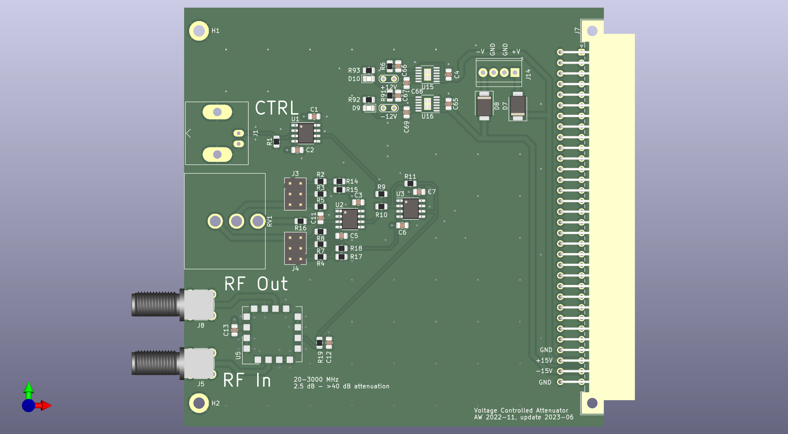

# Attenuator
Voltage Controlled Attenuator based on Mini-Circuits RVA-3000

* BNC connector for control voltage
* SMA connectors for RF-in and RF-out
* 10-turn potentiometer for set-point

Used for laser power stabilization via control of AOM rf drive power.

